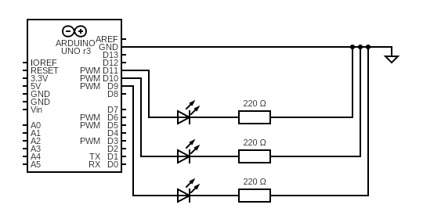

> This repo is for 2025 GDG DevFest Taichung
> 
> Test on Ubuntu24.04, i5-11400, 32GB DDR4, RTX 4060 Ti

# Implement the Live Demo

## Prepare

### 🛠️ 1. Arduino

1. [Download & install Arduino IDE](https://docs.arduino.cc/software/ide/)
2. Connect Arduino UNO to computer
3. Write the code in [here](./arduino_code/led_serial_port_control/led_serial_port_control.ino) into Arduino
4. Set the LEDs and resistors as this: 

### 🧠 2. Local LLM

#### 🚀 Using the device with CUDA support

> You will need [Docker](https://www.docker.com/get-started/) and [docker-compose](https://github.com/docker/compose) installed.
>
> Use this command to make sure your Docker can see GPU:  
> ```bash
> docker run --rm --gpus all nvidia/cuda:12.2.0-base-ubuntu22.04 nvidia-smi
> ```
> 
> [Installing the NVIDIA Container Toolkit](https://docs.nvidia.com/datacenter/cloud-native/container-toolkit/latest/install-guide.html)

1. Go to [unsloth/gemma-3-27b-it-qat](https://huggingface.co/unsloth/gemma-3-27b-it-qat) and choose a GGUF model which can fit in your device.
2. Put the GGUF file into [model folder](./llamacpp-deploy/model/)
3. Copy [.env.example](./llamacpp-deploy/.env.example) to `.env`
4. Set the `MODEL_FILENAME` to the name of the GGUF file
5. Use the command to start LLM inference engine:
    ```bash
    docker-compose up -d
    ```

    If you have CUDA, you can use the CUDA supported version:
    ```bash
    docker-compose -f docker-compose.cuda.yml up -d
    ```
6. After the server start, you can find the inference engine running on `http://localhost:15412/v1`.

#### 🍎 Using macOS device

Please refer to [here](./llamacpp-deploy/Build%20llama%20cpp%20on%20macOS%20from%20scratch.md) to build llama.cpp from source.

And use the same command as the [docker-compose.yml](./llamacpp-deploy/docker-compose.yml) to start the inference engine.
If you prefer running without Docker on macOS (recommended for stability with Metal), launch the server directly after build:

```bash
# Example: run OpenAI-compatible server with Metal, expose on 15412
/path/to/llama.cpp/build/bin/llama-server \
  -m /absolute/path/to/model/your.gguf \
  --host 0.0.0.0 --port 15412 --jinja --ngl 99 \
  -c 16384 --threads $(sysctl -n hw.ncpu)
```

Then verify:
```bash
curl -fsS http://localhost:15412/health
curl -fsS http://localhost:15412/v1/models | jq .
```

### 🔌 3. Local MCP Server

> **Platform Support**: This MCP server currently supports **Linux** and **macOS** only.

> Make sure the Arduino you set up in the [previous step](#1-arduino) is connected.

#### 🐧 For Linux Users

1. Go to [here](./mcp/lights-mcp-server/)
2. Use the command to start the MCP server:
    ```bash
    docker-compose up -d
    ```

> The MCP server will automatically find the device named `ttyACM`. If your Arduino has a different name, please modify the [code](./mcp/lights-mcp-server/src/server.py).

#### 🍏 For macOS Users

Due to Docker Desktop's architecture limitations on macOS, USB devices cannot be directly mounted to containers. We provide helper scripts to handle this:

1. Go to [here](./mcp/lights-mcp-server/)
2. Install `socat` if you haven't (required for serial port forwarding):
    ```bash
    brew install socat
    ```
3. Use the startup script to launch the MCP server:
    ```bash
    ./start-macos.sh
    ```
4. To stop the service, use:
    ```bash
    ./stop-macos.sh
    ```

> The startup script will automatically detect your Arduino device and set up TCP forwarding. For more details about the technical implementation, please refer to [PLATFORM_SUPPORT.md](./mcp/lights-mcp-server/PLATFORM_SUPPORT.md).

### 🌐 4. Open-WebUI

1. Go to [here](./open-webui-deploy/)
2. Use the command to start Open-WebUI:
    ```bash
    docker-compose up -d
    ```
3. After the service started, you can visit Open-WebUI on `http://localhost:9910`. (You have to sign up an account for yourself first time.)

---

## 🎉 Funny part

### 🤖 Single Agent Demo
> Prerequisites: make sure the Local LLM (15412) and MCP server (2000) are running.`.

1. Go to [here](./local-spark/)
2. Start the server:
    ```bash
    docker-compose up -d
    ```
3. (Optional) If you want to see the agent trace log, please copy [`.env.example`](./local-spark/.env.example) to `.env` and set your OpenAI API key.
4. Go to Open-WebUI, add the connection `http://localhost:5411/v1` with OpenAI-Compatible, and you can set API key to whatever.
5. Now you can see `LOCAL-SPARK` in the model list and you can start play with it.

### 🧑‍🤝‍🧑 Multi Agent Demo
> Prerequisites: make sure the Local LLM (15412) and MCP server (2000) are running.`.

1. Go to [here](./local-spark-ma/)
2. Start the server:
    ```bash
    docker-compose up -d
    ```
3. (Optional) If you want to see the agent trace log, please copy [`.env.example`](./local-spark-ma/.env.example) to `.env` and set your OpenAI API key.
4. Go to Open-WebUI, add the connection `http://localhost:5412/v1` with OpenAI-Compatible, and you can set API key to whatever.
5. Now you can see `LOCAL-SPARK-MA` in the model list and you can start play with it.

---

## 📚 Further Reading and Resources

- [ai-agents-for-beginners](https://github.com/microsoft/ai-agents-for-beginners)
- [mcp-for-beginners](https://github.com/microsoft/mcp-for-beginners)
- [Deep Dive into LLMs like ChatGPT](https://youtu.be/7xTGNNLPyMI)
- [Context Engineering for AI Agents with LangChain and Manus](https://youtu.be/6_BcCthVvb8)